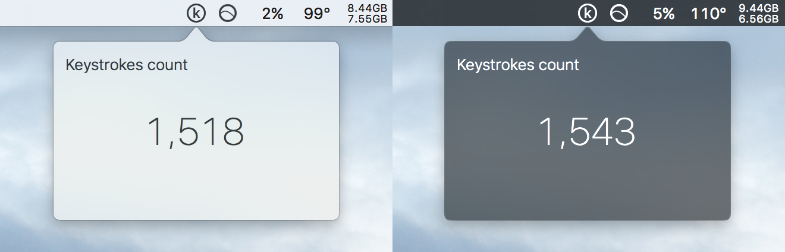

# LR-Daily-Key-Count-OS-X
A simple OS X app that counts keystrokes system-wide

### Download
* [Download the app][app] - Version 0.1
[app]: ./DailyKeyCount-0.1.app.zip?raw=true

### Usage
__Note: You will need to add this app to the Accessbility whitelist to make it work properly.__
* Go to __Preferences__ -> __Security & Privacy__ -> __Privacy__ tab.
* Click on the __+__ button to add this app to the whitelist.

### License
[MIT Licese][license]

[license]: ./LICENSE
